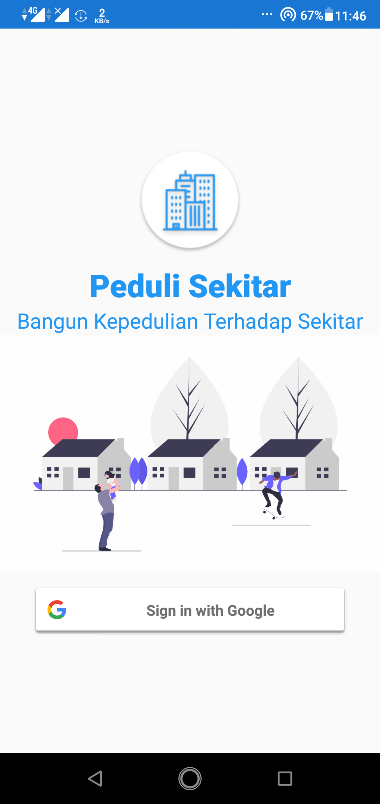
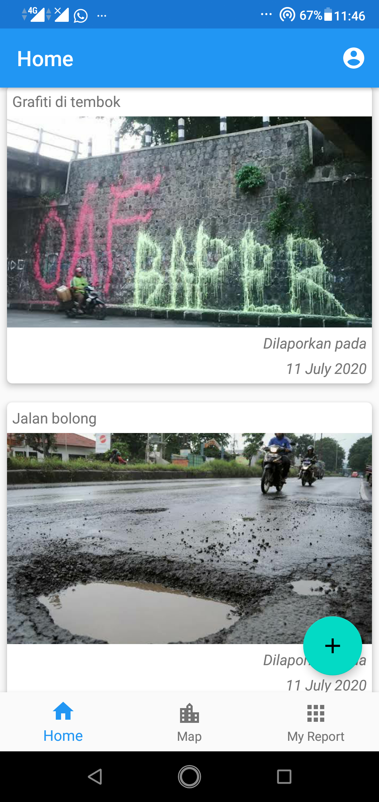
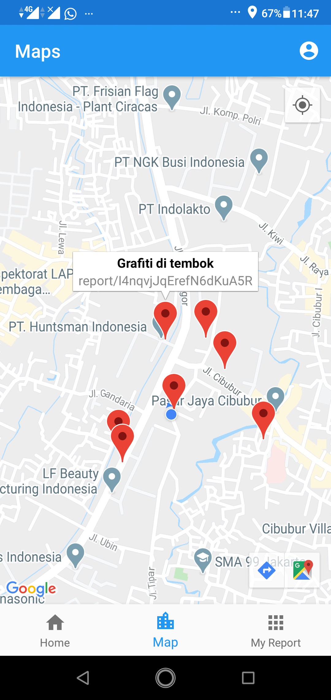
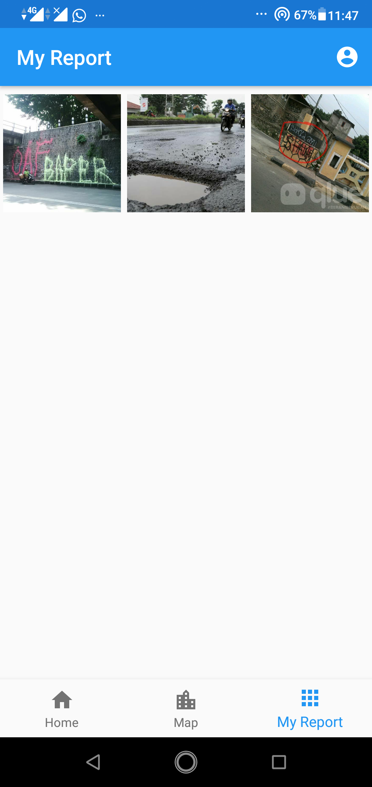
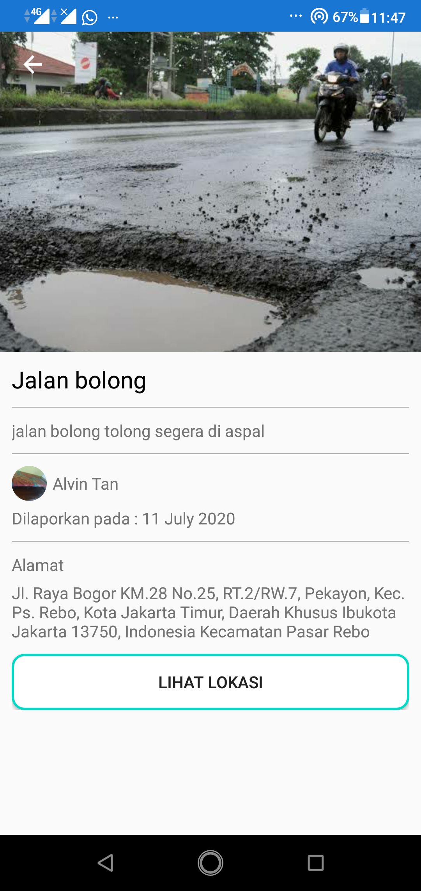
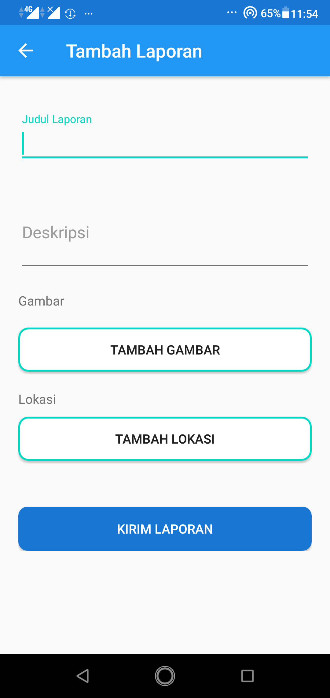

<h1 align="center">
Peduli Sekitar
</h1>
Peduli Sekitar is an application to report problems to the government. This is my final exam project for Mobile Programming. Peduli Sekitar is inspired by Qlue Smart City Apps.

## Screenshots

  
  
  
  
  
  

## Features

- [x] Google Sign In
- [x] Home
- [x] Maps all report location
- [x] My Reports
- [x] Detail Report
- [x] Add Report
- [x] Profile
- [x] Edit Profile

## Tech Stack
- [x] Java
- [x] View Binding
- [x] Firebase Auth
- [x] Cloud Firestore
- [x] Firebase Cloud Storage
- [x] Maps API

## Apps
<a href="https://drive.google.com/file/d/1CT3f5dRcFja-dOvXc0uLNSASuCs9-Iv_/view?usp=sharing" title="Peduli Sekitar Apps">Download Here</a>

## Author
| [ <b>Alvin Tandiardi</b>](https://github.com/alvintan05)  |
| :-----------------------------------------------------------------------------------------------------------------------------------------------------------------: |
